# Guia passo a passo — Instalação e integração Wazuh SIEM com INCIDENT_SYS

**Projeto:** INCIDENT_SYS (Incident Security System)  
**SIEM:** Wazuh 4.9.2 (all-in-one)  
**Servidor:** Ubuntu — `dell5820-tower`  
**IP do Wazuh:** `10.208.1.229`  
**Disco de dados:** `/dev/sdb` montado em `/mnt` (pasta de trabalho `/mnt/MMB`)  
**Data de referência:** Junho/2026  

---

## Sumário

1. [Visão geral da arquitetura](#1-visão-geral-da-arquitetura)
2. [Pré-requisitos](#2-pré-requisitos)
3. [Passo 1 — Preparar estrutura em /mnt/MMB](#passo-1--preparar-estrutura-em-mntmmb)
4. [Passo 2 — Montagem permanente do disco (/etc/fstab)](#passo-2--montagem-permanente-do-disco-etcfstab)
5. [Passo 3 — Firewall e swap](#passo-3--firewall-e-swap)
6. [Passo 4 — Instalação Wazuh all-in-one](#passo-4--instalação-wazuh-all-in-one)
7. [Passo 5 — Acesso ao Dashboard](#passo-5--acesso-ao-dashboard)
8. [Passo 6 — Integração INCIDENT_SYS no Wazuh](#passo-6--integração-incident_sys-no-wazuh)
9. [Passo 7 — Integração no INCIDENT_SYS (Windows)](#passo-7--integração-no-incident_sys-windows)
10. [Passo 8 — Validação e consulta de alertas](#passo-8--validação-e-consulta-de-alertas)
11. [Regras customizadas (referência)](#regras-customizadas-referência)
12. [Solução de problemas](#solução-de-problemas)
13. [Checklist final](#checklist-final)

---

## 1. Visão geral da arquitetura

```
[Windows — INCIDENT_SYS :3000]
   │  PostgreSQL + ML (Flask :5001)
   │  Ao criar incidente → syslog UDP JSON
   ▼
[Ubuntu — Wazuh Manager 10.208.1.229]
   │  Decoder JSON + Regras local_rules.xml
   │  Indexer em /mnt/MMB/wazuh/indexer (disco /dev/sdb)
   ▼
[Dashboard Wazuh :443] — alertas SOC
```

**Figura 1 — Visão do Dashboard após instalação bem-sucedida:**

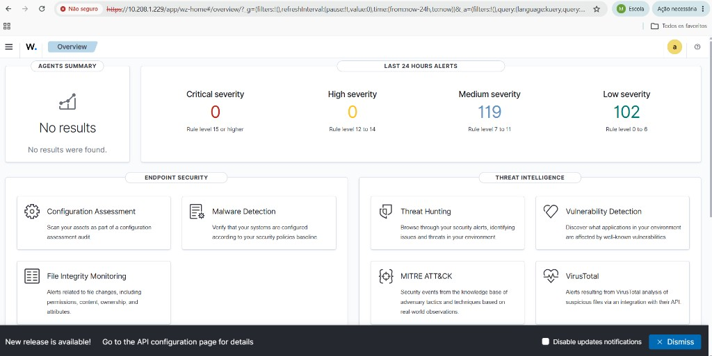

**Fluxo de um incidente:**

1. Analista registra incidente na UI do INCIDENT_SYS.
2. ML classifica (categoria, confiança, risco).
3. Backend envia JSON via **syslog UDP porta 514**.
4. Wazuh decodifica, aplica regras do grupo `incident_sys`.
5. Alerta aparece em `alerts.log` e no Dashboard.

---

## 2. Pré-requisitos

| Item | Recomendação |
|------|----------------|
| SO servidor | Ubuntu 22.04 / 24.04 LTS |
| RAM | 8 GB+ (servidor usado: 31 GB) |
| Disco `/` | Espaço livre razoável (evitar >90%) |
| Disco `/dev/sdb` | Montado em `/mnt` (~3,5 TB livres) |
| Acesso | SSH com usuário `sudo` |
| Portas | 443, 514/udp, 1514, 1515, 55000 |
| INCIDENT_SYS | Windows com Node.js, `.env` configurado |

**Figura 2 — Espaço em disco: `/` quase cheio e `/mnt` (sdb) com 3,5 TB livres:**

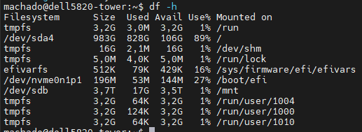

---

## Passo 1 — Preparar estrutura em /mnt/MMB

Conectar via SSH:

```bash
ssh machado@10.208.1.229
```

Criar pastas no disco grande:

```bash
sudo mkdir -p /mnt/MMB/{wazuh,incident_sys,logs,backups}
sudo chown -R $USER:$USER /mnt/MMB
chmod 755 /mnt/MMB
```

Estrutura esperada:

```
/mnt/MMB/
├── wazuh/
│   ├── indexer/      # dados do Wazuh Indexer (bind mount)
│   └── ossec/        # logs (opcional)
├── incident_sys/
│   └── siem/         # backup NDJSON
├── logs/
└── backups/
```

**Validação:**

```bash
ls -la /mnt/MMB/
```

**Figura 3 — Pastas criadas em `/mnt/MMB` (wazuh, incident_sys, logs, backups):**

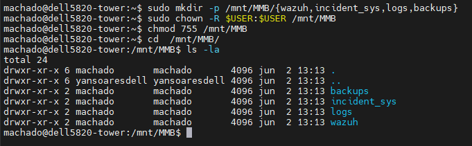

---

## Passo 2 — Montagem permanente do disco (/etc/fstab)

Confirmar UUID do disco:

```bash
sudo blkid /dev/sdb
```

Editar fstab:

```bash
sudo nano /etc/fstab
```

Adicionar (ajustar UUID):

```fstab
UUID=7cb139dd-45e2-45dd-b79b-72f876474803  /mnt  ext4  defaults,nofail  0  2
```

Testar:

```bash
sudo mount -a
df -h /mnt
```

**Validação:** `/mnt` deve mostrar `/dev/sdb` com ~3,5 TB livres.

**Figura 4 — Partição `/dev/sdb` (UUID) identificada com `lsblk -f`:**

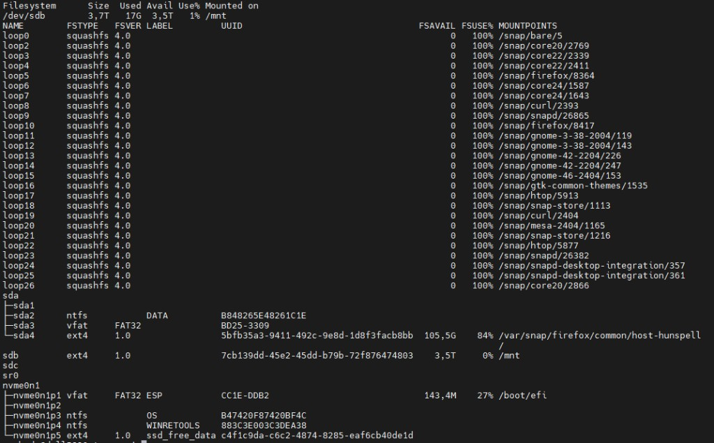

**Figura 5 — Entrada adicionada em `/etc/fstab` para montar `/mnt` automaticamente:**

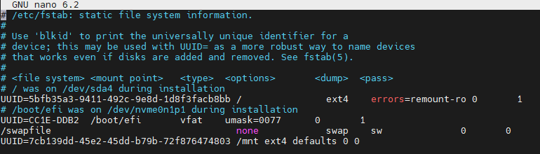

---

## Passo 3 — Firewall e swap

```bash
sudo ufw allow 443/tcp comment 'Wazuh Dashboard'
sudo ufw allow 1514/tcp comment 'Wazuh Agents'
sudo ufw allow 1515/tcp comment 'Wazuh Enrollment'
sudo ufw allow 55000/tcp comment 'Wazuh API'
sudo ufw reload

# Swap extra no disco grande (4 GB)
sudo fallocate -l 4G /mnt/MMB/swapfile
sudo chmod 600 /mnt/MMB/swapfile
sudo mkswap /mnt/MMB/swapfile
sudo swapon /mnt/MMB/swapfile
grep -q '/mnt/MMB/swapfile' /etc/fstab || \
echo '/mnt/MMB/swapfile none swap sw 0 0' | sudo tee -a /etc/fstab
```

**Validação:**

```bash
sudo ufw status
free -h
swapon --show
```

---

## Passo 4 — Instalação Wazuh all-in-one

### 4.1 — Bind mount do Indexer (antes da instalação)

```bash
sudo mkdir -p /mnt/MMB/wazuh/indexer /var/lib/wazuh-indexer
sudo mount --bind /mnt/MMB/wazuh/indexer /var/lib/wazuh-indexer
grep -q 'wazuh/indexer' /etc/fstab || \
echo '/mnt/MMB/wazuh/indexer /var/lib/wazuh-indexer none bind 0 0' | sudo tee -a /etc/fstab
```

**Validação:**

```bash
df -h /var/lib/wazuh-indexer
# Deve mostrar /dev/sdb com ~3,5T
```

**Figura 6 — Bind mount do indexer confirmado (`df -h` aponta para `/dev/sdb`):**

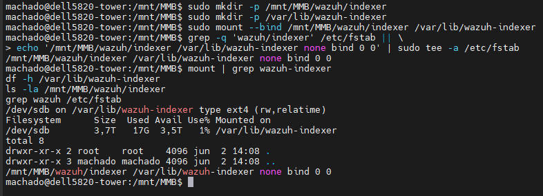

### 4.2 — Baixar instalador

Usar curl nativo (evitar curl Snap):

```bash
sudo apt install -y curl wget
cd /mnt/MMB
/usr/bin/curl -sO https://packages.wazuh.com/4.9/wazuh-install.sh
chmod +x wazuh-install.sh
ls -lh wazuh-install.sh
```

**Figura 7 — Pasta `/mnt/MMB` e instalação do `curl` nativo (`/usr/bin/curl`):**

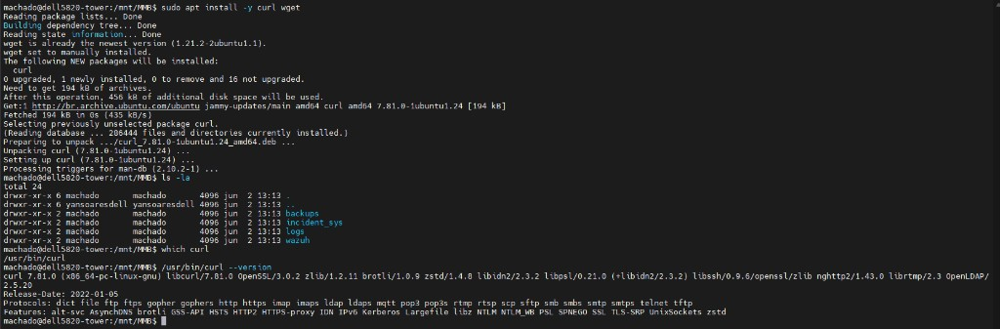

**Figura 8 — Aviso do curl Snap (usar `/usr/bin/curl` em vez do Snap):**

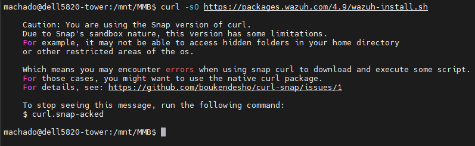

### 4.3 — Limpeza (se houver tentativa anterior)

```bash
sudo systemctl stop wazuh-dashboard wazuh-manager wazuh-indexer filebeat 2>/dev/null
sudo apt purge -y wazuh-indexer wazuh-manager wazuh-dashboard filebeat 2>/dev/null
sudo rm -rf /etc/wazuh-indexer /etc/wazuh-dashboard /var/ossec
sudo rm -rf /mnt/MMB/wazuh/indexer/*
mount | grep -q wazuh-indexer || sudo mount --bind /mnt/MMB/wazuh/indexer /var/lib/wazuh-indexer
sudo rm -f /mnt/MMB/wazuh-install-files.tar
```

**Figura 9 — Limpeza completa antes de reinstalar (purge + remoção de pastas):**

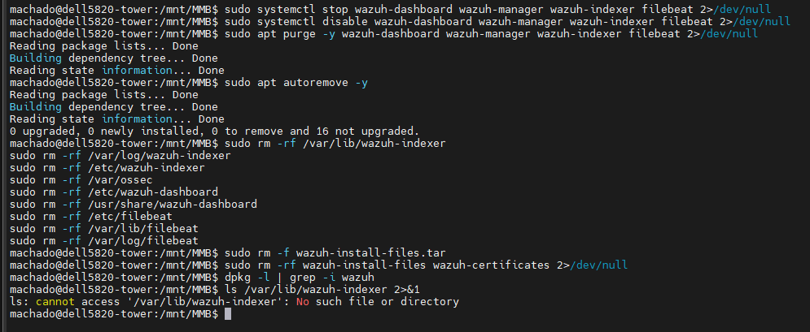

**Figura 10 — Liberar espaço em `/var` (`apt clean` + análise com `du`):**

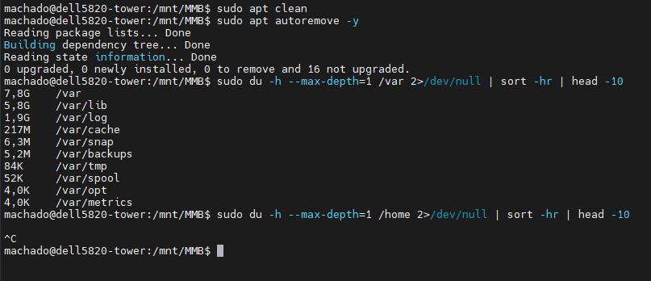

### 4.4 — Instalar

```bash
cd /mnt/MMB
sudo bash wazuh-install.sh -a -i
```

Aguardar 20–45 minutos. Se falhar no dashboard, ver seção [Solução de problemas](#solução-de-problemas).

**Figura 11 — Erro comum: “Wazuh indexer already installed” (usar `-o` para sobrescrever):**

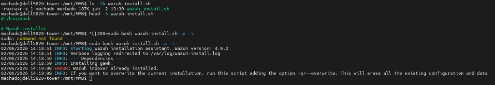

### 4.5 — Validar instalação

```bash
sudo systemctl status wazuh-indexer wazuh-manager wazuh-dashboard --no-pager
sudo ss -tlnp | grep -E '443|55000|9200'
sudo tar -O -xvf /mnt/MMB/wazuh-install-files.tar wazuh-install-files/wazuh-passwords.txt
df -h /var/lib/wazuh-indexer
```

Guardar senhas em local seguro. **Não commitar** no Git.

---

## Passo 5 — Acesso ao Dashboard

1. Navegador: `https://10.208.1.229`
2. Aceitar certificado autoassinado.
3. Login: usuário **`admin`**
4. Senha: `indexer_password` do arquivo `wazuh-passwords.txt`.

**Validação:** Tela Overview do Wazuh carrega sem erro permanente de API.

**Figura 12 — Tela Overview com alertas nas últimas 24 horas (instalação OK):**


---

## Passo 6 — Integração INCIDENT_SYS no Wazuh

### 6.1 — Pasta de eventos

```bash
sudo mkdir -p /mnt/MMB/incident_sys/siem
sudo chown wazuh:wazuh /mnt/MMB/incident_sys/siem
```

### 6.2 — Configurar ossec.conf

```bash
sudo cp /var/ossec/etc/ossec.conf /var/ossec/etc/ossec.conf.bak.iss
sudo vim /var/ossec/etc/ossec.conf
```

Dentro de `<ossec_config>`:

```xml
  <remote>
    <connection>syslog</connection>
    <port>514</port>
    <protocol>udp</protocol>
    <allowed-ips>0.0.0.0/0</allowed-ips>
  </remote>

  <localfile>
    <log_format>json</log_format>
    <location>/mnt/MMB/incident_sys/siem/events.ndjson</location>
  </localfile>
```

> **Produção:** substituir `0.0.0.0/0` pelo IP do PC Windows do INCIDENT_SYS.

### 6.3 — Decoder

Arquivo: `/var/ossec/etc/decoders/local_decoder.xml`

```xml
<decoder name="incident-sys-json">
  <parent>json</parent>
  <prematch>"source":"incident_security_system"</prematch>
</decoder>
```

> **Nota:** `JSON` ou `JSON_Decoder` como plugin causou erro no Wazuh 4.9.2. Usar `parent>json</parent>`.

### 6.4 — Regras

Arquivo: `/var/ossec/etc/rules/local_rules.xml`

```xml
<group name="incident_sys,">
  <rule id="100100" level="0">
    <decoded_as>json</decoded_as>
    <field name="source">incident_security_system</field>
    <description>INCIDENT_SYS: evento recebido</description>
  </rule>

  <rule id="100110" level="8">
    <if_sid>100100</if_sid>
    <field name="event_type">incident.created</field>
    <description>INCIDENT_SYS: novo incidente registrado</description>
  </rule>

  <rule id="100120" level="12">
    <if_sid>100110</if_sid>
    <field name="ia_classification">malware</field>
    <description>INCIDENT_SYS: IA classificou como malware</description>
  </rule>

  <rule id="100130" level="15">
    <if_sid>100120</if_sid>
    <field name="risk_level">critical</field>
    <description>INCIDENT_SYS: incidente CRITICO detectado pela IA</description>
  </rule>

  <rule id="100140" level="10">
    <if_sid>100110</if_sid>
    <field name="ia_classification">phishing</field>
    <description>INCIDENT_SYS: IA classificou como phishing</description>
  </rule>
</group>
```

### 6.5 — Firewall syslog

```bash
sudo ufw allow 514/udp comment 'INCIDENT_SYS syslog'
sudo ufw reload
```

### 6.6 — Reiniciar manager e validar config

```bash
sudo /var/ossec/bin/wazuh-analysisd -t
sudo systemctl restart wazuh-manager
sudo systemctl is-active wazuh-manager
```

### 6.7 — Teste com logtest

```bash
sudo /var/ossec/bin/wazuh-logtest
```

Colar uma linha JSON:

```json
{"source":"incident_security_system","event_type":"incident.created","incident_id":999,"title":"Teste","ia_classification":"malware","ia_confidence":0.95,"risk_level":"critical","status":"open"}
```

**Esperado Phase 3:** regra `100130`, level `15`, `Alert to be generated`.

### 6.8 — Teste via arquivo

```bash
echo '{"source":"incident_security_system","event_type":"incident.created","incident_id":1001,"title":"Teste ISS v2","ia_classification":"malware","ia_confidence":0.95,"risk_level":"critical","status":"open"}' | sudo tee -a /mnt/MMB/incident_sys/siem/events.ndjson
sudo chown wazuh:wazuh /mnt/MMB/incident_sys/siem/events.ndjson
sleep 60
sudo grep -i "100130\|Teste ISS" /var/ossec/logs/alerts/alerts.log | tail -5
```

---

## Passo 7 — Integração no INCIDENT_SYS (Windows)

No projeto `incident_security_system`, arquivo `.env`:

```env
SIEM_ENABLED=true
WAZUH_DELIVERY=syslog
WAZUH_SYSLOG_HOST=10.208.1.229
WAZUH_SYSLOG_PORT=514
```

Reiniciar aplicação:

```powershell
cd D:\MMB\workspace\incident_security_system
pnpm dev
```

Criar incidente na UI. No terminal Node deve aparecer:

```text
[SIEM] Evento incident.created incidente #N enviado (syslog)
```

**Validação no servidor:**

```bash
sleep 30
sudo grep -i "incident_security_system" /var/ossec/logs/alerts/alerts.log | tail -5
```

---

## Passo 8 — Validação e consulta de alertas

### 8.1 — Linha de comando

```bash
sudo grep -i "Ransomware\|incident_security_system" /var/ossec/logs/alerts/alerts.log | tail -10
sudo grep "Rule:" /var/ossec/logs/alerts/alerts.log | grep -i incident | tail -5
```

### 8.2 — Dashboard Wazuh 4.9

| Onde | Ação |
|------|------|
| **Server management → Rules** | Ver regras 100100–100140, grupo `incident_sys` |
| **Threat intelligence → Events** | Buscar: `rule.groups:incident_sys` ou `data.source:incident_security_system` |
| **Threat Hunting** | Buscar título do incidente ou `source: incident_security_system` |

**Figura 13 — Regras customizadas 100100–100140 no Dashboard (Server management → Rules):**

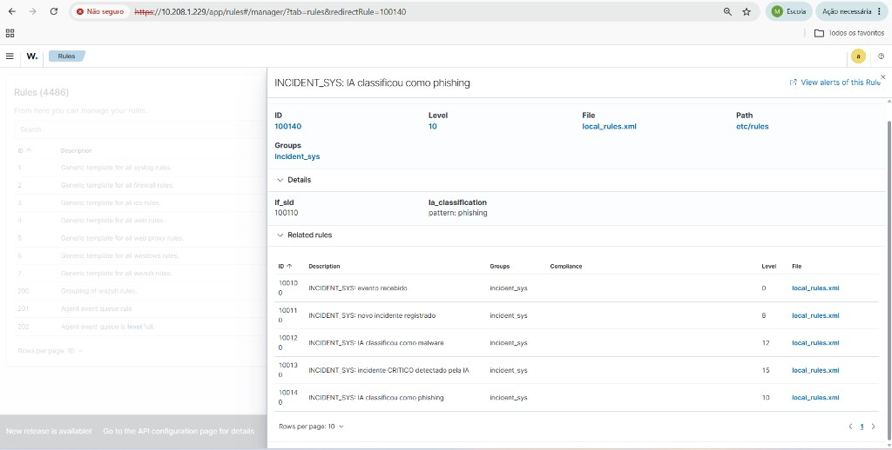

### 8.3 — Qual regra dispara?

| Classificação IA | Risco | Regra típica | Nível |
|------------------|-------|--------------|-------|
| Qualquer | — | 100100 | 0 |
| incident.created | — | 100110 | 8 |
| malware | — | 100120 | 12 |
| malware | critical | **100130** | **15** |
| phishing | — | **100140** | **10** |

Exemplo real validado: incidente "Ransomware na rede interna" → **phishing** + **high** → regra **100140** (nível 10).

---

## Regras customizadas (referência)

| ID | Nível | Descrição |
|----|-------|-----------|
| 100100 | 0 | Evento recebido |
| 100110 | 8 | Novo incidente registrado |
| 100120 | 12 | IA: malware |
| 100130 | 15 | Incidente crítico (malware + critical) |
| 100140 | 10 | IA: phishing |

Arquivos no servidor:

- `/var/ossec/etc/decoders/local_decoder.xml`
- `/var/ossec/etc/rules/local_rules.xml`
- `/var/ossec/etc/ossec.conf` (remote syslog + localfile)

---

## Solução de problemas

### Dashboard não inicializa na instalação

**Figura 14 — Erro típico: dashboard não conecta ao indexer (`ECONNREFUSED 127.0.0.1:9200`):**

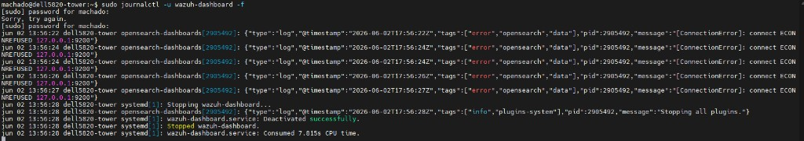

- Limpar resíduos (`apt purge`, `rm -rf /var/lib/wazuh-indexer`).
- Bind mount em `/mnt/MMB/wazuh/indexer` antes de reinstalar.
- `sudo bash wazuh-install.sh -a -i -o`

### Erro decoder `Invalid plugin_decoder: JSON`

Usar decoder com `<parent>json</parent>` em vez de `<plugin_decoder>JSON</plugin_decoder>`.

### Manager não inicia após regras

```bash
sudo /var/ossec/bin/wazuh-analysisd -t
sudo tail -20 /var/ossec/logs/ossec.log
```

### wazuh-logtest: erro connecting analysisd

Manager precisa estar `active` antes do logtest.

### Alertas no log mas não no Dashboard

- Ajustar período: Last 24 hours.
- Buscar `rule.id:100140` ou título do incidente.
- Verificar regra correta (phishing ≠ 100130).

### curl Snap no Ubuntu

```bash
sudo apt install -y curl
/usr/bin/curl -sO https://packages.wazuh.com/4.9/wazuh-install.sh
```

### Comandos Linux no terminal Windows (MobaXterm local)

Comandos como `journalctl` e `systemctl` **só funcionam no SSH do servidor Ubuntu** (`machado@dell5820-tower`), não no terminal local do Windows/Cygwin.

---

## Checklist final

- [ ] `/mnt/MMB` criado e `/dev/sdb` no fstab
- [ ] Bind mount indexer em `/mnt/MMB/wazuh/indexer`
- [ ] Wazuh 4.9.2 instalado (indexer, manager, dashboard)
- [ ] Dashboard acessível em `https://10.208.1.229`
- [ ] `local_decoder.xml` e `local_rules.xml` configurados
- [ ] UFW: 443, 514/udp, 1514, 1515, 55000
- [ ] logtest gera alerta regra 100130 (teste malware+critical)
- [ ] INCIDENT_SYS com `SIEM_ENABLED=true`
- [ ] Incidente na UI gera entrada em `alerts.log`
- [ ] Regras visíveis em Server management → Rules

---

## Referências

- Documentação Wazuh: https://documentation.wazuh.com/
- Repositório INCIDENT_SYS: https://github.com/margefson/incident_security_system
- Integração SIEM no código: `server/integrations/siem/`

---

*Documento gerado para o projeto INCIDENT_SYS — integração com Wazuh SIEM.*
